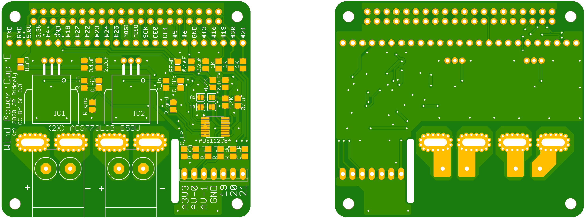

# Wind-Power-Meter
Hardware and software for a Raspberry Pi hat which measures the power produced by one or two small wind turbines.

## Hardware
The hardware consists of a circuit board designed in the style of a Raspberry
Pi HAT, but it's not an official HAT because an identifier ROM which is part of
the HAT specification isn't present.  Call it a "Cap" or something. 

The board uses a pair of Hall-effect current sensors to measure the current
output of the wind turbine; it is expected that the output will be somewhat
dirty DC, and simple filtering is provided.  Voltage dividers reduce the
voltage output of the turbine to safe levels.  Voltage and current are then
digitized with an ADS112C04 analog to digital converter that talks over an
I^2^C interface with the Raspberry Pi. 

## Software
It's just a Python program which gets data from the ADS112C04 and plots some 
plots. 

The software documentation page is at 
<https://spluttflob.github.io/Wind-Power-Meter/>.

### Pi Setup
When setting up a Raspberry Pi, one must enable the I^2^C interface using
`raspi-setup` or the **Raspberry Pi Configuration** program from the desktop's
applications menu.  It's often a good idea to enable **SSH**, the **VNC** 
remote desktop, and **SPI** as well. 

This software is designed to run on a "headless" Raspberry Pi. It has been
tested on the October 2021 release of Raspberry Pi OS. 
There's a nice page showing how to set up a "headless" (no monitor) Raspberry
Pi at 
<https://www.tomshardware.com/reviews/raspberry-pi-headless-setup-how-to,6028.html>.

### Dependencies

One needs the **PySimpleGUI** package for plotting as well as **Matplotlib**. 

* To install Matplotlib, run `sudo apt install python3-matplotlib` on the Pi.

* To install PySimpleGUI, run `sudo pip3 install pysimplegui` on the Pi.

### VNC Issues
The Remmina client on a Linux PC has problems authenticating with the VNC 
desktop server on the Pi unless one adds the line `Authentication=VncAuth` 
to the file `/root/.vnc/config.d/vncserver-x11` on the Pi and then restarts 
the VNC server on the Pi with a command such as 
`systemctl restart vncserver-x11-serviced` (or a reboot).  
Other clients such as those for Windows&trade; or MacOS&trade; may or may not 
require such action to be taken. 

