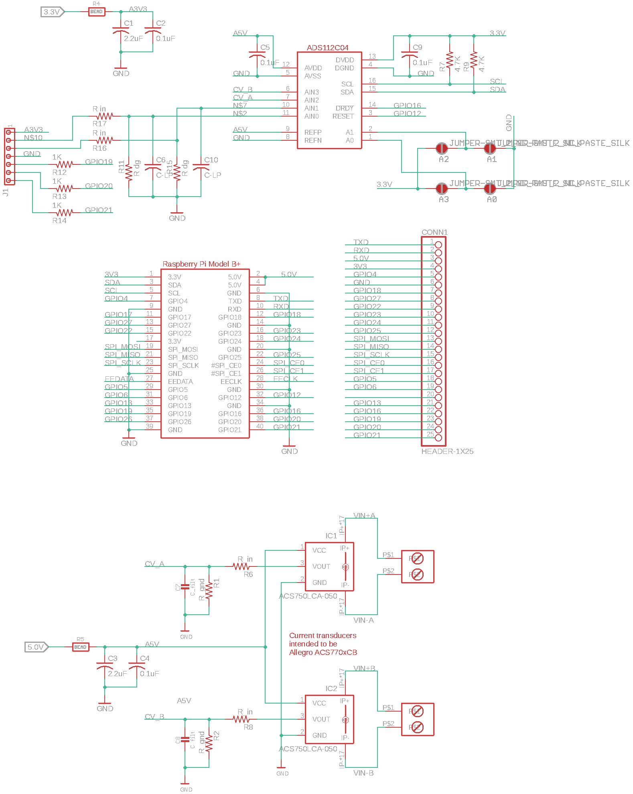

# Hardware

Here are schematics done in standalone Autodesk&trade; Eagle PCB.
They should be easy to import into the Fusion 260&trade; version of Eagle
or into KiCAD (recommended). 

_An image of the schematic for somewhat convenient reference._
